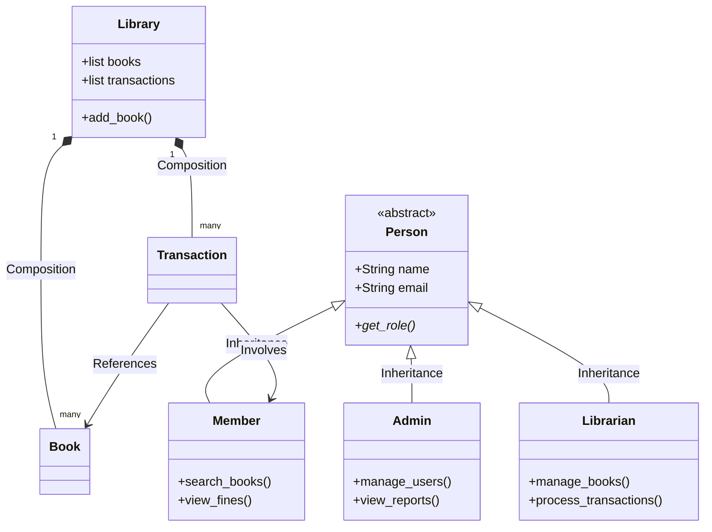
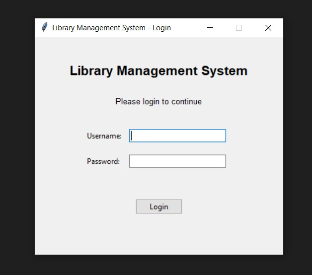
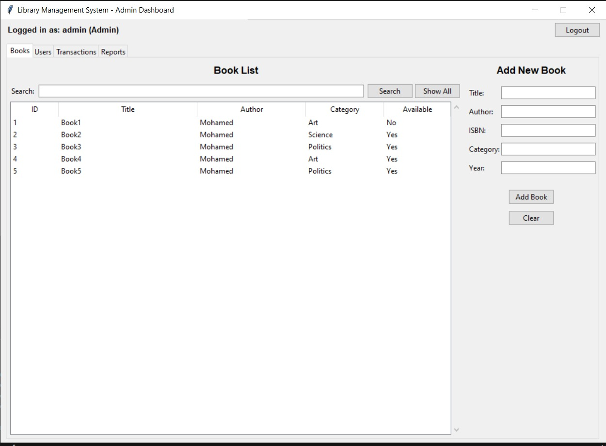

# 📚 Library Management System

A comprehensive library management system built with Python, demonstrating Object-Oriented Programming principles. This system provides complete functionality for managing books, users, and transactions with both CLI and GUI interfaces.

---

## 📋 Table of Contents

- [Features]
- [System Architecture]
- [OOP Principles]
- [Installation]
- [Usage]
- [Project Structure]
- [Team Contributions]
- [Technologies Used]
- [Future Enhancements]

---

## ✨ Features

### Core Functionality

- 📖 **Book Management**: Add, update, delete, and search books
- 👥 **User Management**: Manage admins, librarians, and members
- 🔄 **Transaction System**: Borrow and return books with due date tracking
- 💰 **Fine Calculation**: Automatic late fee calculation ($1/day)
- 🔍 **Advanced Search**: Search by title, author, ISBN, or category
- 📊 **Reports & Analytics**: Generate insights on library usage
- 🔐 **Authentication**: Role-based access control system
- 💾 **Data Persistence**: JSON-based storage for all data

### User Roles

1. **Admin** - Full system access

   - Manage all users (add/remove admins, librarians, members)
   - Manage books and transactions
   - View all reports

2. **Librarian** - Operational access

   - Manage books (add/update/delete)
   - Process borrowing and returns
   - View reports
   - Cannot manage users

3. **Member** - Limited access
   - Search books
   - View borrowed books
   - Check account information
   - View outstanding fines

---

## 🏗️ System Architecture

### 🧩 Class Hierarchy & Relationships



```text
┌──────────────────────────────────────────┐
│        User Interface (CLI/GUI)          │
├──────────────────────────────────────────┤
│      Authentication & Authorization      │
├──────────────────────────────────────────┤
│       Business Logic (Controllers)       │
├──────────────────────────────────────────┤
│          Data Models (Classes)           │
├──────────────────────────────────────────┤
│      Utilities (Validation, Search)      │
├──────────────────────────────────────────┤
│           Data Storage (JSON)            │
└──────────────────────────────────────────┘
```

### Key Components:

- **Models**: Person hierarchy (Admin, Librarian, Member), Book, Transaction
- **Controllers**: Library (main business logic)
- **Utils**: Database, Validator, SearchEngine, ReportGenerator, AuthSystem
- **Views**: Menu system for CLI, GUI windows for Tkinter interface

---

## 🎨 OOP Principles

This project demonstrates all four pillars of Object-Oriented Programming:

### 1. Encapsulation

```python
class Book:
    def __init__(self, book_id, title):
        self._book_id = book_id      # Private attribute
        self._title = title

    def get_book_id(self):           # Public getter
        return self._book_id
```

### 2. Inheritance

```
Person (Abstract Base Class)
├── Admin
├── Librarian
└── Member
```

### 3. Polymorphism

```python
admin.display_info()    # Shows admin-specific information
member.display_info()   # Shows member-specific information
```

### 4. Abstraction

```python
class Person(ABC):
    @abstractmethod
    def get_role(self):
        pass  # Must be implemented by subclasses
```

---

## 🚀 Installation

### Prerequisites

- Python 3.8 or higher
- Tkinter (usually comes with Python)

### Steps

1. **Clone the repository**

```bash
git clone https://github.com/Nadeeen232/Library-Management-System.git
cd Library-Management-System
```

2. **No additional dependencies required!**

   - All required libraries are part of Python's standard library

3. **Verify installation**

```bash
python --version  # Should show Python 3.8+
```

---

## 📖 Usage

### Running the CLI Version

```bash
python src/main.py
```

**Default Login Credentials:**

- **Admin**: `admin` / `admin123`
- **Librarian**: `librarian` / `lib123`

### Running the GUI Version

```bash
python src/gui_main.py
```

The GUI provides a visual interface with the same functionality as the CLI.

---

## 📂 Project Structure

```
library-management-system/
│
├── src/
│   ├── main.py                      # CLI entry point
│   ├── gui_main.py                  # GUI entry point
│   │
│   ├── models/                      # Data models
│   │   ├── __init__.py
│   │   ├── person.py                # Person, Admin, Librarian, Member
│   │   ├── book.py                  # Book class
│   │   └── transaction.py           # Transaction classes
│   │
│   ├── controllers/                 # Business logic
│   │   ├── __init__.py
│   │   └── library.py               # Main controller
│   │
│   ├── utils/                       # Utility functions
│   │   ├── __init__.py
│   │   ├── auth.py                  # Authentication system
│   │   ├── database.py              # Data persistence
│   │   ├── validator.py             # Input validation
│   │   ├── search_engine.py         # Search functionality
│   │   └── report_generator.py      # Report generation
│   │
│   ├── views/                       # CLI interface
│   │   ├── __init__.py
│   │   └── menu.py                  # Menu system
│   │
│   └── gui/                         # GUI interface
│       ├── __init__.py
│       ├── login_window.py
│       ├── admin_window.py
│       ├── librarian_window.py
│       ├── member_window.py
│       ├── book_management.py
│       ├── user_management.py
│       ├── transaction_management.py
│       └── reports.py
│
├── library_data/                    # Data storage (auto-created)
│   ├── books.json
│   ├── users.json
│   ├── transactions.json
│   └── credentials.json
│
├── README.md                        # This file
└── LICENSE                          # MIT License
```

---

### CLI Interface

```
===== LIBRARY MANAGEMENT SYSTEM =====
1. Book Management
2. User Management
3. Transactions
4. Search
5. Reports
6. Logout
=====================================
Logged in as: admin (Admin)
```

### GUI Interface

**Login Screen**

- Clean authentication interface
- Default credentials displayed
- Secure password field

**Admin Dashboard**

- Tabbed interface (Books, Users, Transactions, Reports)
- Data tables with search functionality
- Easy-to-use forms

**Member Portal**

- Search books interface
- View borrowed books with due dates
- Account information display

---
### 📸 Project Screenshots

#### 🔐 Login Interface


#### 📊 Admin Dashboard


## 👥 Team Contributions

| Name                 | Role                   | Core Contributions                                                                 |
| :------------------- | :--------------------- | :--------------------------------------------------------------------------------- |
| **Mariam Mohamed**   | System Architect       | Designed Core Models (`person.py`, `book.py`, `transaction.py`) and OOP structure. |
| **Rawnaa Usama**     | Backend Developer      | Implemented the `library.py` controller and core business logic.                   |
| **Mohamed Essam**    | Security & Persistence | Developed `auth.py` for security and `database.py` for JSON data management.       |
| **Menna Allah Ehab** | Quality & Integration  | Integrated `main.py` and developed `validator.py` and search/report utilities.     |
| **Nadeen Mohamed**   | UI/UX Developer        | Developed the CLI `menu.py` system and overall project documentation.              |

---

## 🛠️ Technologies Used

### Core Technologies

- **Python 3.8+** - Primary programming language
- **Tkinter** - GUI framework (built-in)
- **JSON** - Data storage format
- **ABC (Abstract Base Classes)** - For abstraction

### Python Libraries Used

- `tkinter` - GUI development
- `json` - Data serialization
- `datetime` - Date/time handling
- `os` - File operations
- `abc` - Abstract base classes

### Development Tools

- **Git** - Version control
- **GitHub** - Code hosting and collaboration
- **VS Code / PyCharm** - IDE
- **Python Standard Library** - No external dependencies!

---

## 📊 System Statistics

| Metric              | Value         |
| ------------------- | ------------- |
| Total Lines of Code | 1,300+        |
| Number of Classes   | 13            |
| Number of Methods   | 150+          |
| Number of Files     | 15+           |
| OOP Principles      | 4/4 ✓         |
| Interfaces          | 2 (CLI + GUI) |

---

## 🔍 Key Features in Detail

### Book Management

- Add new books with validation (ISBN, year, etc.)
- Update book information
- Remove books (only if not borrowed)
- Track total borrows for popularity analysis
- Search by multiple criteria

### Transaction System

- Borrow books with a customizable borrow period
- Automatic due date calculation
- Return processing with overdue detection
- Fine calculation: $1 per day for late returns
- Transaction history tracking

### Search & Filter

- Search books by title (partial match, case-insensitive)
- Search by author
- Search by ISBN (exact match)
- Filter by category
- View available/borrowed books separately

### Reports

1. **Most Borrowed Books** - Top 10 popular books
2. **Active Members Report** - Member statistics
3. **Overdue Books Report** - Books past due date
4. **Fine Revenue Report** - Total outstanding fines
5. **Books by Category Report** - Collection distribution

---

## 🔐 Security Features

- **Role-Based Access Control**: Different permissions for Admin, Librarian, Member
- **Session Management**: Tracks logged-in user
- **Input Validation**: Prevents invalid data entry
- **Access Restrictions**: Unauthorized actions are blocked
- **Data Integrity**: Validates all user inputs

---

## 🐛 Known Limitations

- Single-user system (no concurrent access)
- Passwords stored in plain text (educational project)
- No email notification system
- Limited to local storage (JSON files)
- No backup/restore functionality

---

## 🚀 Future Enhancements

### Short-term

- Password hashing for security
- Export reports to PDF/Excel
- Book reservation system
- Email notifications
- Search history

### Long-term

- Database integration (SQLite/PostgreSQL)
- Multi-library support
- Mobile application
- Barcode scanning
- AI-powered book recommendations
- Data visualization dashboard

---

## 🧪 Testing

### Manual Testing Checklist

- User registration and login
- Book CRUD operations
- Borrow/return workflow
- Fine calculation accuracy
- Search functionality
- Report generation
- Access control verification
- Data persistence

### Test Scenarios

1. **Borrow Flow**: Add book → Register member → Borrow → Verify due date
2. **Return Flow**: Return book late → Verify fine calculation
3. **Access Control**: Try accessing admin features as member
4. **Search**: Search by various criteria
5. **Data Persistence**: Restart application → Verify data loaded

---

## 📝 How to Contribute

1. Fork the repository
2. Create a feature branch (`git checkout -b feature/AmazingFeature`)
3. Commit your changes (`git commit -m 'Add some AmazingFeature'`)
4. Push to the branch (`git push origin feature/AmazingFeature`)
5. Open a Pull Request

### Coding Standards

- Follow PEP 8 style guide
- Add docstrings to all classes and methods
- Use meaningful variable names
- Keep methods focused and short
- Write comments for complex logic

---

## ❓ FAQ

**Q: How do I reset the default admin password?**  
A: Delete `library_data/credentials.json` and restart the program. Default credentials will be recreated.

**Q: Can I add more user roles?**  
A: Yes! Create a new class inheriting from `Person` and update the authentication system.

**Q: How do I backup my data?**  
A: Simply copy the entire `library_data/` folder to a safe location.

**Q: Is this production-ready?**  
A: This is an educational project. For production, you'd need proper database, security, and testing.

**Q: Can multiple people use it simultaneously?**  
A: Currently no. It's designed for single-user operation. Multi-user support would require a database with locking mechanisms.

---
